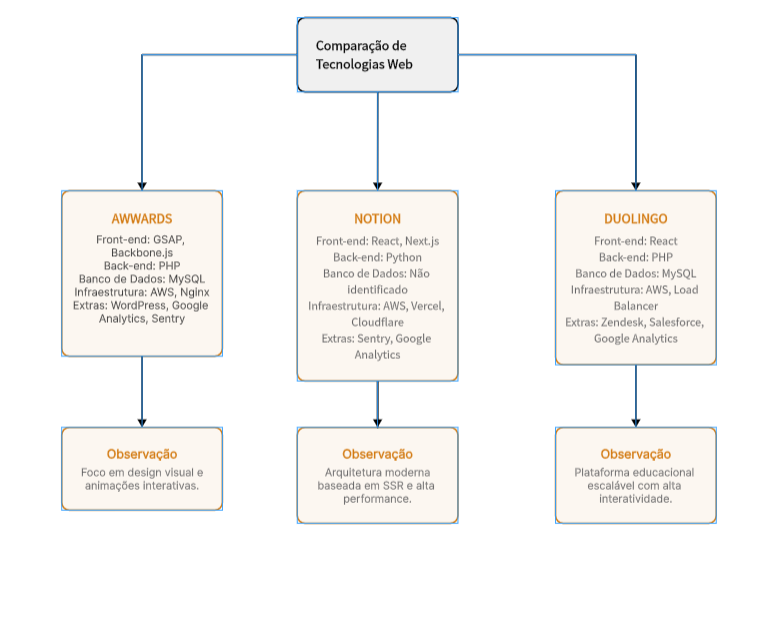

<p align="center">
  
</p>

<div align="center">

# 📚 Aula 01 — Programação Web


</div>

<p align="center">━━━━━━━━━━━━━━━ ◈ ━━━━━━━━━━━━━━━</p>

## 🎯 Apresentação da Disciplina

> ### 📖 Conteúdo abordado
>
> ✦ Objetivos de aprendizagem
> ✦ Ementa
> ✦ Conteúdo programático
> ✦ Metodologia de ensino
> ✦ Recursos didáticos
> ✦ Critérios de avaliação
> ✦ Bibliografia

A disciplina de **Programação Web** combina princípios de design visual com tecnologias web para criação de interfaces digitais funcionais e modernas.

---

## 👨‍🏫 Sobre o Professor

> Mestrado em Ciência da Computação
> Especialização em Inteligência Artificial
> Pós-graduações Lato Sensu
> Graduação em ADS
> Experiência como Gerente de Projetos
> Atuação como Professor Universitário

<p align="center">✦ ✧ ✦</p>

---

## 🔄 Versionamento e Deploy

Controle de versão permite:

> ✦ Registrar alterações
> ✦ Recuperar versões anteriores
> ✦ Trabalhar em equipe
> ✦ Criar branches

Ferramentas citadas:

> GitHub • GitLab • Bitbucket

Deploy é o processo de disponibilizar uma aplicação em ambiente online.

Também foram apresentados conceitos de:

> CI/CD • Automação de deploy • Monitoramento de aplicações

---

## 🏗 Arquitetura de um Site

Envolve:

> ✦ Definição de escopo
> ✦ Estruturação do projeto
> ✦ UX/UI
> ✦ Prototipação
> ✦ Validação e refinamento de ideias

<p align="center">━━━━━━━━━━━━━━━ ◈ ━━━━━━━━━━━━━━━</p>

---

## ⚡ JavaScript — A base da interatividade

JavaScript é uma linguagem interpretada essencial para o front-end.

Permite:

> ✦ Manipular HTML
> ✦ Criar interatividade
> ✦ Comunicação com servidores
> ✦ Implementar lógica de interface

```js
console.log("Hello Web World 🌐");
```

---

## 🧩 Frameworks Front-end

Principais citados:

> React • Vue • Angular

Conceitos importantes:

> Componentização • Gerenciamento de estado • Rotas • Integração com APIs

---

## 🔙 Frameworks Back-end

Conceitos abordados:

> Arquitetura MVC
> APIs REST
> Banco de Dados
> Autenticação
> Segurança

---

## 🗄 Banco de Dados NoSQL

Características:

> Não relacional
> Schema dinâmico
> Escalabilidade horizontal
> Distribuição de dados

---

## 🌐 Servidores, Hospedagem e CMS

Foram apresentados:

> Conceito de hospedagem
> CMS
> Website builders
> Vantagens e limitações dessas ferramentas

---

## 📊 Critérios de Avaliação

```
(P1 × 0.25) + (P2 × 0.25) + ((PJ + AT) × 0.25)
```

> P1 → Prova 1
> P2 → Prova 2
> PJ → Projeto
> AT → Atividades

---

## 💼 Importância do Portfólio

Manter um portfólio permite:

> ✦ Demonstrar habilidades práticas
> ✦ Evidenciar domínio técnico
> ✦ Facilitar oportunidades de estágio
> ✦ Preparar para o mercado profissional

<div align="center">
  
</div>

<p align="center">━━━━━━━━━━━━━━━ ◈ ━━━━━━━━━━━━━━━</p>

---

# 🔍 Atividade 04 — Análise de Tecnologias Web

Foi realizada uma análise das tecnologias utilizadas em três plataformas reais:

> **Awwwards**
> **Notion**
> **Duolingo**

A identificação foi feita através de ferramentas de detecção de stack tecnológica.

---

## 🧠 Comparação de Arquiteturas

<p align="center">
  
</p>

<p align="center">
<sub>Mapa mental comparando stacks tecnológicos modernos</sub>
</p>

---

<div align="center">

### 👨‍💻 Henrique Pinheiro de Oliveira

<sub>Análise e Desenvolvimento de Sistemas — FATEC</sub> <sub>Construindo meu portfólio em público 🚀</sub>


</div>
